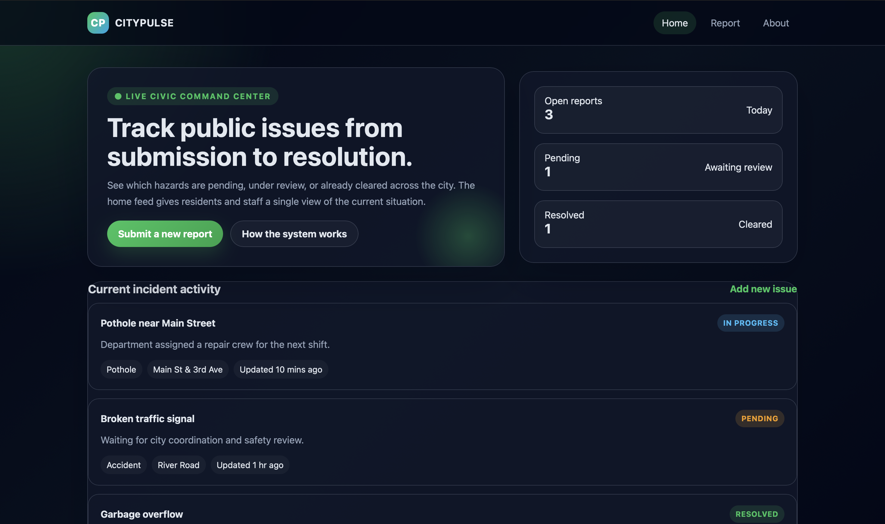

# 🌆 CityPulse: Serverless Live Civic Command Center


CityPulse is a full-stack, cloud-native civic engagement dashboard designed to track public urban issues from initial submission to final resolution. Built with an event-driven serverless architecture, the platform empowers residents to report hazards (e.g., potholes, broken traffic signals, garbage overflows) while providing city staff with a real-time command center interface to triage and monitor current incident activities.



---

## 🏗️ Architecture Blueprint

The application leverages a decoupled, serverless structure to optimize performance, eliminate server management, and ensure high security for data and file uploads.

* **Frontend Layer:** A single-page, responsive dashboard utilizing modern glassmorphic UI conventions, custom CSS gradients, and vanilla JavaScript async network streams to interface directly with cloud resources.
* **API Gateway Node:** Acts as the secure entry point, handling RESTful routes and enabling seamless Cross-Origin Resource Sharing (CORS) preflight exchanges between the browser and the AWS cloud ecosystem.
* **Secure File Pipeline (S3 Pre-signed URLs):** Rather than routing heavy media uploads through intermediate servers or lambdas, the application calls a secure backend gateway to fetch transient **S3 Pre-signed URLs**. The frontend client then securely uploads image evidence *directly* to an isolated Amazon S3 bucket, ensuring optimal upload speeds and minimal resource consumption.

---

## 🛠️ Infrastructure Component Breakdown

| Technology Component | Functional Role inside Pipeline |
| :--- | :--- |
| **HTML5 / CSS3** | Delivers the modern glassmorphic dashboard interface, dark-mode visual hierarchy, and structural layouts. |
| **JavaScript (ES6+)** | Manages dynamic state mutations, event listeners, dynamic UI time updates, and asynchronous HTTP fetch networks. |
| **Amazon API Gateway** | Provisions robust managed endpoints to safely route data packages and ingest incoming incident requests. |
| **Amazon S3** | Serves as high-speed immutable object storage holding uploaded civic image attachments via secure temporary pre-signed keys. |
| **AWS Console** | Utilized as the centralized operational dashboard for provisioning cloud architecture infrastructure, handling security policies, and managing service logs. |

---

## 💻 Technical Design & Features

* **Live Status Triage Metrics:** Displays structured metric cards capturing `Open Reports`, `Pending Reviews`, and `Resolved Tasks` generated dynamically based on active databases.
* **Incident Lifecycle Workspace:** Tracks hazards through color-coded status pills (`PENDING`, `IN PROGRESS`, `RESOLVED`) alongside department assignment logs and relative updated timestamps.
* **Granular Image Upload Architecture:** Leverages pre-signed cryptographically signed authorization strings to allow clients direct S3 binary access, keeping data transfers highly secure and cost-efficient.

---

## 🚀 Step-by-Step Deployment Guide

### 1. Configure the Cloud Storage Vault (Amazon S3)
1. Log into your **AWS Management Console**.
2. Navigate to **S3** and select **Create Bucket**. Name it something unique (e.g., `citypulse-incident-media-vault`).
3. Under the **Permissions** tab, configure your bucket's **CORS (Cross-Origin Resource Sharing)** policy to accept incoming uploads from your web interface domain:
   ```json
   [
     {
       "AllowedHeaders": ["*"],
       "AllowedMethods": ["PUT", "POST"],
       "AllowedOrigins": ["*"],
       "ExposeHeaders": []
     }
   ]
